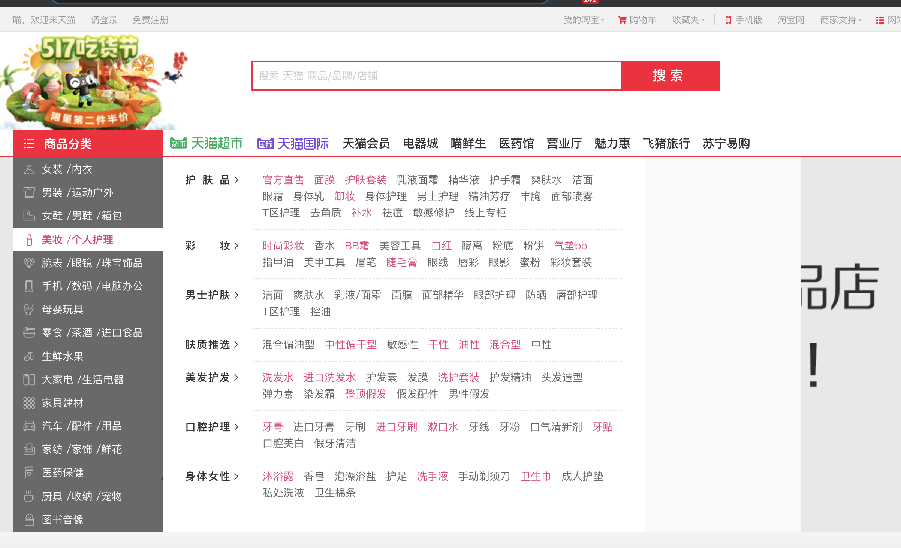
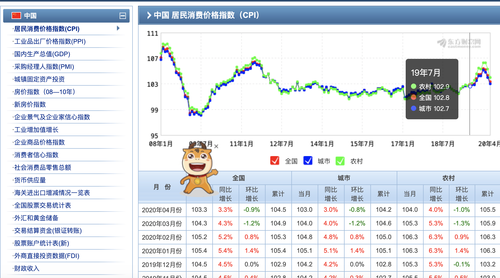

# Scarpy Crawling data(for Summing up data information)
# Requirement:
- Python 3+
- bs4(BeatifulSoup) 4.8.2
- requests 2.22.0
- Anaconda 3+

> Now we already have seven scarpy projects:

#  [Beauty](Beauty.py)
[A website full of beauties](http://www.mzitu.com)

You can get any pictures in your folder.

# [Dlut](Dlutimfor.py)
[Academic affairs notice of Dalian University of Technology](http://ssdut.dlut.edu.cn/bkspy/benkeshengjiaoxue.htm)

You can get any texts in your folder.

# [House Price](House_price.py)
[Crawling FangTianXia](https://sz.esf.fang.com)

You can get all information about houses in ShengZhen.

Final, there will be a csv files including(city_name,name, location, house size, area, price, price_sum, dire, floor, build_time, advantage)

# [TMall](TianMao(TaoBao).py)
[A website with a large number of products](https://www.tmall.com/?ali_trackid=2:mm_26632258_3504122_55934697:1589699369_223_389701381&clk1=4819bf57c8379ef093802b827aa5f2cd&upsid=4819bf57c8379ef093802b827aa5f2cd)

You can get detailed information and comments about the product (including follow-up comments and detailed comment time).

# [JD](JingDong.py)
[A website with a large number of products](https://www.jd.com/?cu=true&utm_source=baidu-pinzhuan&utm_medium=cpc&utm_campaign=t_288551095_baidupinzhuan&utm_term=0f3d30c8dba7459bb52f2eb5eba8ac7d_0_74b9877e5cfd4962b61e9dfc4c3d5672)

You can get detailed information and comments about the product (including follow-up comments and detailed comment time).

# [Handsome](Handsome.py)
[A website full of handsome guys](http://www.shuaigepic.com/)

# [EastMoney](EastMoney.py)
[A website about wealth and people's livelihood data](https://data.eastmoney.com/cjsj/consumerpriceindex.aspx?p=)

# [Where you go](getCPIFromEastMoney.py)

[Introduction to various tourist attractions in China](https://data.eastmoney.com/cjsj/consumerpriceindex.aspx?p=)

