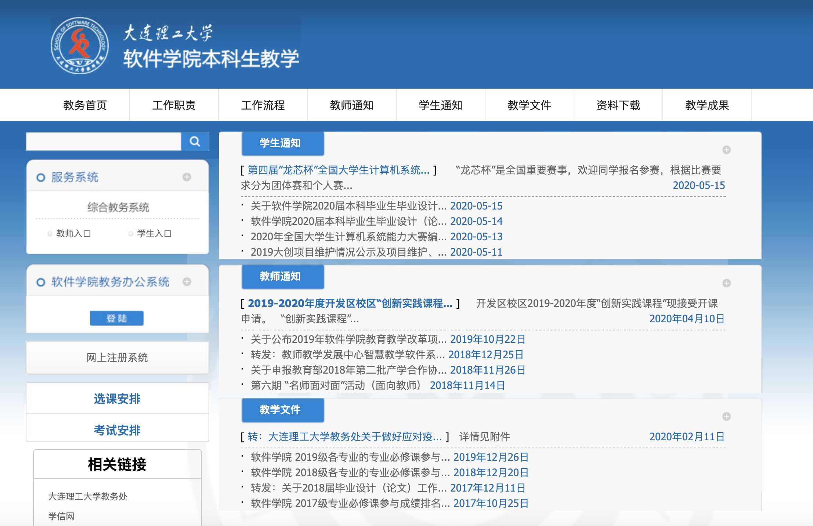

# Scarpy Crawling data(for Summing up data information)
# Requirement:
- Python 3+
- bs4(BeatifulSoup) 4.8.2
- requests 2.22.0
- Anaconda 3+

> Now we already have seven scarpy projects:

#  [Beauty](Beauty.py)
[A website full of beauties](http://www.mzitu.com)

You can get any pictures in your folder.

# [Dlut](Dlutimfor.py)
[Academic affairs notice of Dalian University of Technology](http://ssdut.dlut.edu.cn/bkspy/benkeshengjiaoxue.htm)

You can get any texts in your folder.

#[]

